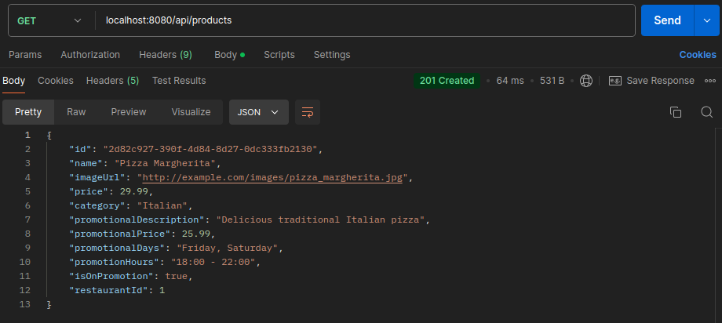
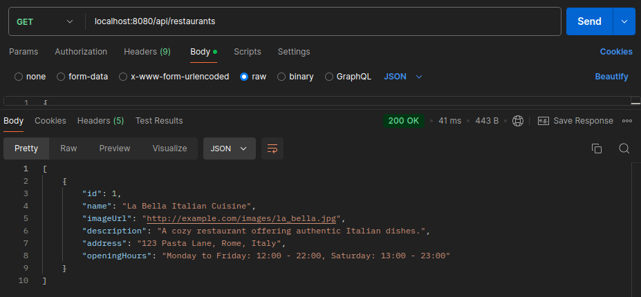

## Challenge - Developer Backend

    
<b>Produtos</b>

    

    
<b>Restaurantes</b>

    

### Sobre
- **Nome do Projeto:** Goomer Lista Rango
- **Objetivo do Projeto:** Criar uma API RESTful capaz de gerenciar os restaurantes e os produtos do seu cardápio.
- **Tecnologias:** Java, Spring Boot e MySQL.
- **Aprendizados**: Durante o desenvolvimento deste projeto, tive a oportunidade de explorar a implementação de Interface Specification, permitindo consultas dinâmicas e personalizadas ao banco de dados.

### Desafio
- Listar todos os restaurantes
- Cadastrar novos restaurantes
- Listar os dados de um restaurante
- Alterar os dados um restaurante
- Excluir um restaurante
- Listar todos os produtos de um restautante
- Criar um produto de um restaurante
- Alterar um produto de um restaurante
- Excluir um produto de um restaurante

#### Restaurante
- O cadastro do restaurante precisa ter os seguintes campos:
    - Foto do restaurante
    - Nome do restaurante
    - Endereço do restaurante
    - Horários de funcionamento do restaurante (ex.: De Segunda à Sexta das 09h as 18h e de Sabado à Domingo das 11h as 20h).

#### Produtos
- O cadastro de produtos do restaurante precisa ter os seguintes campos:
    - Foto do produto
    - Nome do produto
    - Preço do produto
    - Categoria do produto (ex.: Doce, Salgados, Sucos...)
    - Quando o Produto for colocado em promoção, precisa ter os seguintes campos:
        - Descrição para a promoção do produto (ex.: Chopp pela metade do preço)
        - Preço promocional
        - Dias da semana e o horário em que o produto deve estar em promoção
